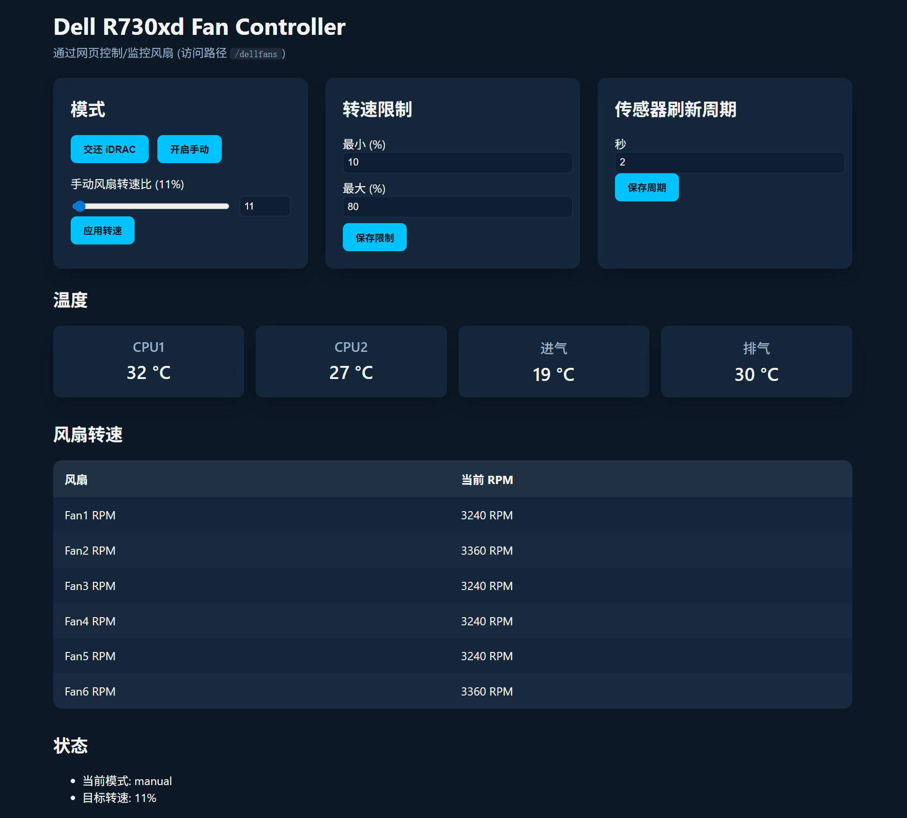

# Dell R730xd Fan Controller（中文）

[English Version](README.md)

Python 服务，可通过 `http://<服务器IP>:6180/dellfans` 控制并监控 Dell PowerEdge R730xd 的风扇。功能包括：

- 获取 CPU1/CPU2、进气、排气温度以及所有风扇的转速；
- 在网页上查看实时数据、模式状态和告警信息；
- 自定义手动模式的最小/最大转速百分比并切换控制权；
- 程序退出时自动将风扇控制权交还给 iDRAC。

> **提示**：程序需要访问 `/dev/ipmi0`，请使用 `sudo` 运行或确保当前用户拥有访问权限。

## 界面截图



## 运行

### 手动前台运行

```bash
cd /data/home/dylan/dellfans
sudo python3 main.py
```

关闭终端后服务会直接退出。

### systemd 后台运行

1. 复制服务文件并重新加载 systemd：
   ```bash
   sudo cp /data/home/dylan/dellfans/dellfans.service /etc/systemd/system/
   sudo systemctl daemon-reload
   ```
2. 启动并设置开机自启：
   ```bash
   sudo systemctl enable --now dellfans.service
   ```
3. 日常管理：
   ```bash
   sudo systemctl status dellfans.service
   sudo journalctl -u dellfans.service -f
   sudo systemctl stop dellfans.service
   ```

随后即可访问 `http://<服务器IP>:6180/dellfans`。

## 配置

程序会在运行目录生成 `config.json`，字段说明如下：

| 字段 | 说明 |
| --- | --- |
| `min_pwm` / `max_pwm` | 手动模式的最小/最大百分比（0–100） |
| `default_pwm` | 切换到手动模式后的默认转速百分比 |
| `poll_interval_seconds` | 传感器轮询周期（秒），支持小数，最小 0.5 |
| `listen_host` / `listen_port` | Web 服务监听地址（默认为 `0.0.0.0:6180`） |
| `transport` | `auto`（默认）、`kcs` 或 `lan`。iDRAC9/14G+ 建议用 `lan` |
| `lan_host` / `lan_user` / `lan_password` | iDRAC 的 IP/账号/密码，用于 lanplus；当 `transport` 为 `lan` 或在 iDRAC9+ 下自动选择时必填 |
| `lan_port` / `lan_privilege` | lanplus 端口（默认 623）和权限等级（默认 `ADMIN`） |
| `use_bridge` / `bridge_channel` / `bridge_target` | 可选 IPMB 桥接设置（默认 `false`，通道 `6`，目标 `0x2c`） |

网页端可以直接调整最小/最大限制和轮询周期，修改后会写回 `config.json`。

### 调整传感器轮询周期

默认周期为 `2.0` 秒，可用以下方式修改：

1. **网页端**：在 `/dellfans` 页面的“传感器刷新周期”输入秒数（≥0.5，可带小数），点击“保存周期”立即生效。
2. **命令行**：调用 REST 接口（示例：改为 1.5 秒）：
   ```bash
   curl -X POST http://<服务器IP>:6180/dellfans/api/poll_interval \
        -H 'Content-Type: application/json' \
        -d '{"seconds": 1.5}'
   ```
   将 `<服务器IP>` 替换为实际地址（或 `127.0.0.1`）。接口会同时更新 `config.json` 和后台线程，无需重启 systemd 服务。

## 不同 iDRAC 代际的部署方式

### 旧版 iDRAC（7/8，11G/13G，如 R730xd）
- 通过宿主 KCS `/dev/ipmi0` 发送命令，无需网络账号。
- 以 root 运行或给当前用户权限，`transport` 设为 `kcs` 或默认 `auto` 即可。
- 不依赖 `ipmitool`。

### 新版 iDRAC（9，14G/15G，如 R940/R740/R650/R750）
- Dell 在宿主通道禁用了旧版风扇覆写命令，需要走 iDRAC lanplus。
- 先安装 `ipmitool`，并提供 iDRAC 账户：
  ```bash
  export DELLFANS_IDRAC_HOST=<idrac-ip>
  export DELLFANS_IDRAC_USER=<user>
  export DELLFANS_IDRAC_PASSWORD=<password>
  # 可选：export DELLFANS_IDRAC_PORT=623
  ```
  或在 `config.json` 设置 `transport: "lan"` 和 `lan_host`/`lan_user`/`lan_password`。
- 如需要 IPMB 桥接，可启用 `use_bridge: true`，并根据平台调整 `bridge_channel` / `bridge_target`（默认 6 / 0x2c）。
- 重启服务，启动日志会打印所选传输方式；若 BMC 拒绝命令，UI/API 会直接显示 IPMI 完成码，便于排查。

## 安全

- 手动模式使用 Dell OEM IPMI 指令：`0x30 0x30 0x01 0x00`（关闭自动）和 `0x30 0x30 0x02 0xff <pwm>`（设置百分比）。
- 程序退出（包括异常）会自动发送 `0x30 0x30 0x01 0x01` 将控制权交还给 iDRAC。
- 需要恢复自动控制时，可在网页点击“交还 iDRAC”或调用相应 API。
